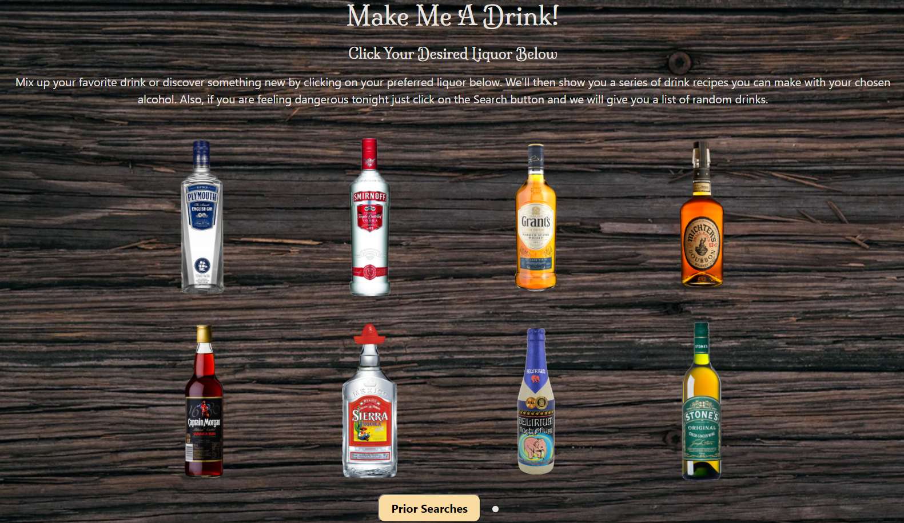

# Make me a drink!

## 7th Module: Group project

Conceive and execute a design with your team that solves a real-world problem by integrating data received from multiple server-side API requests to create an interactive front-end project.

## Details

**AS a rookie mixologist,**\
**I WANT** to search a drink for friends or customer.\
**I WANT** to know what kinds of drinks I can make with a type of Liquor.\
**I WANT** to search for drink recipes that include a specific hard liquor,\
**SO THAT** I can go to a liquor store near me to purchase the ingredients and make the drink.

## Acceptance Criteria

**GIVEN** a Make A Drink with form inputs\
**WHEN** I search for a liquor or drink name\
**THEN** I am presented with type of drinks and recipes for those drinks and show the glass that should be used\
**WHEN** I view drink show me what I can use to sub\
**WHEN** I view the a liquor that don’t have\
**THEN** I am presented with a place where i can get it\
**WHEN** I view recipe\
**THEN** I am presented with it will what to use to measure it with show the amount and the amount and what to use to measure it with\
**WHEN** I click on a drink in the search history\
**THEN** I am again presented with the recipe again

**Repository URL:** https://github.com/utake6d6/7-make-me-a-drink

**Website URL:** https://utake6d6.github.io/7-mix-drinks/

**Screenshot:** 
